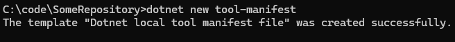
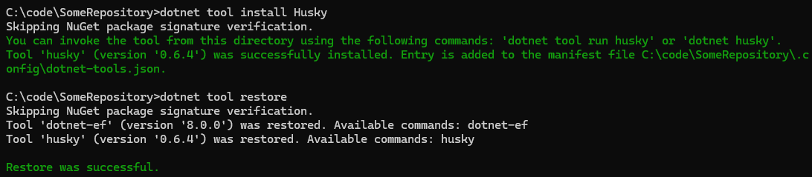
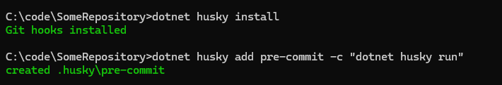
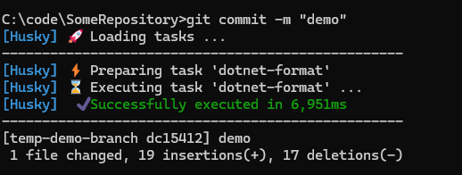

# Autoformatting with Husky.NET

## Introduction

Formatting code is a perennial issue. Some people love to get everything just right for readability - and I am one of those. And some think that this is just wasting time and introducing diffs with no actual content. And they also have a point. I don't think that this point is wrong as such, we just have different priorities. And that it's OK for different people to have priorities when working together.

But the real way to keep everyone happy  is to automate it, so that formatting happens consistently without wasting time.

We'll assume that you  have [an `.editorconfig` file](https://editorconfig.org/) with [preferred styles](https://learn.microsoft.com/en-us/dotnet/fundamentals/code-analysis/code-style-rule-options) in the repository. That's a separate topic so we'll assume that it's already covered. The good news is that `dotnet format` will use this file's settings.

What should happen is that when making a `git` commit, then `dotnet format` should be run over the changed files.

This can be done by glueing `git` and `dotnet format` together using a tool called [Husky.NET](https://alirezanet.github.io/Husky.Net/), which can be used to run command-line tools including `dotnet format` on [git's pre-commit hook](https://git-scm.com/book/en/v2/Customizing-Git-Git-Hooks).

## Here's how

### 1: Prepare the repository to use dotnet local tools

First, prepare the repository to [use dotnet local tools](https://learn.microsoft.com/en-us/dotnet/core/tools/local-tools-how-to-use) by creating a tools manifest.

Assuming that your repository checkout folder is e.g. `C:\Code\SomeRepository`, it goes like this:

```cmd
cd C:\Code\SomeRepository
dotnet new tool-manifest
```



NB: if you already have a tools manifest, this command can be skipped. and will in any case fail with an error message like this:

```txt
Creating this template will make changes to existing files:
  Overwrite   ./.config/dotnet-tools.json

To create the template anyway, run the command with '--force' option:
```

If you see this message, you're already good and can move on to the next step.

### 2: Install husky

In the same repository folder, run:

```cmd
dotnet tool install Husky
dotnet tool restore
```



This will create an entry for husky in the tools manifest at `C:\code\SomeRepository\.config\dotnet-tools.json`. Husky is now a local tool in the solution.

### 3 Configure Husky

Configure husky to run on the pre-commit git hook

```cmd
dotnet husky install
dotnet husky add pre-commit -c "dotnet husky run"
```



There should now be a folder `C:\code\SomeRepository\.husky` with files `pre-commit` and `task-runner.json`

### 4 Configure the pre-commit action

Configure the pre-commit action to run a `dotnet format` on changed `.cs` files. Edit the file `.husky/task-runner.json` created by the last step, set the contents to:

```json
{
   "tasks": [
      {
         "name": "dotnet-format",
         "group": "pre-commit",
         "command": "dotnet",
         "args": ["format","--no-restore", "--include", "${staged}"],
         "include": ["**/*.cs"]
      }
   ]
}
```

### 5 try it out

Time to play! Create out a new disposable branch and change a file.

Change a `.cs` file and make a commit: it should run dotnet format on the changed file!




Now work as before, and husky formatting will kick in when needed, on only the files that are part of the commit.


## Troubleshooting

### Disabling

If you ever need to temporarily disable the autoformat, do this:

* Take a copy of  `.husky/task-runner.json` for when it's time to re-enable it.
* replace the contents of `.husky/task-runner.json` with:

```json
{
   "tasks": [ ]
}
```

### Teamwork

Depending on your team, you might want to keep this setup locally, or commit the files in `.config` and `.husky` to git so that the whole team has these tools. It's probably better to make this decision after discussion, rather than surprising your colleagues with it!

It's certainly better when everyone does it. But you can still use Husky.NET for formatting yourself without that.
